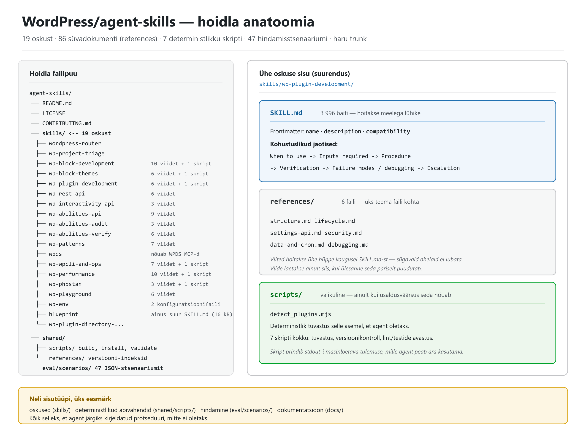
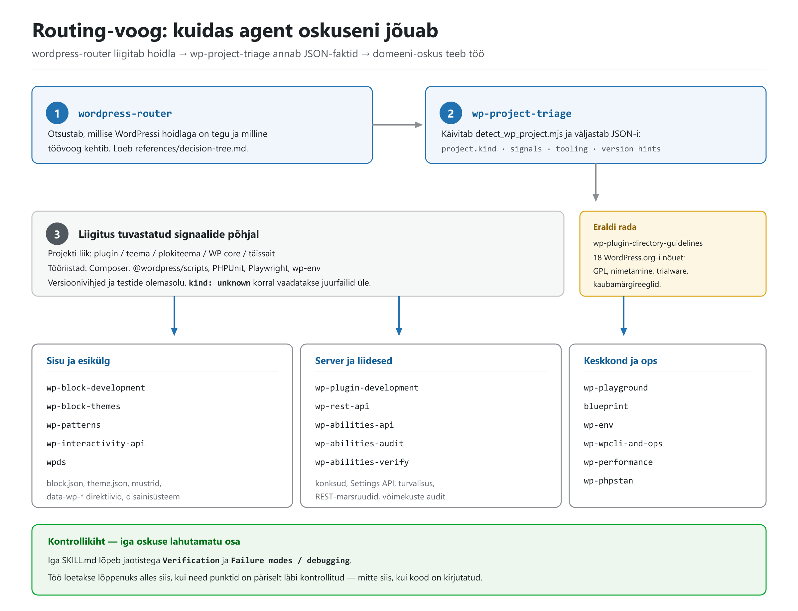
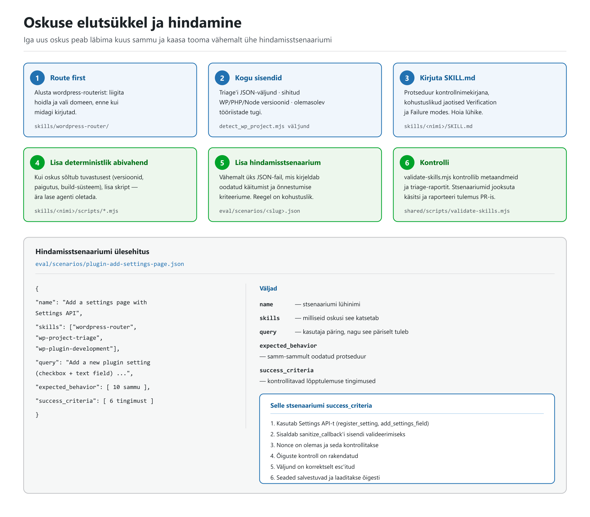
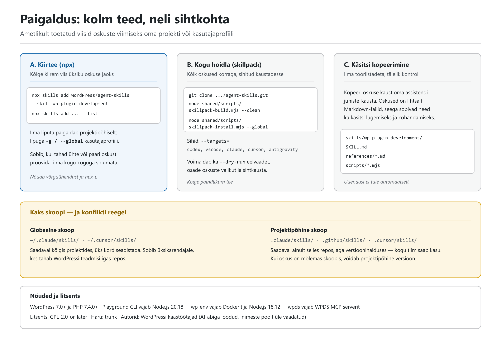

# WordPress/agent-skills — täielik ülevaade

**Struktureeritud dokument hoidla [`WordPress/agent-skills`](https://github.com/WordPress/agent-skills) kohta: mis see on, kuidas see töötab, mida iga oskus teeb, ja täielik näide tekstina.**

| | |
|---|---|
| **Hoidla** | `WordPress/agent-skills` |
| **Kirjeldus** | *Expert-level WordPress knowledge for AI coding assistants — blocks, themes, plugins, and best practices* |
| **Haru** | `trunk` |
| **Litsents** | GPL-2.0-or-later (`LICENSE`: *Agent Skills for WordPress, Copyright (C) 2026 WordPress Contributors*) |
| **Loodud** | 20. jaanuar 2026 |
| **Viimane push** | 5. oktoober 2026 |
| **Tähed / kahvlid** | 2 199 ★ / 330 kahvlit |
| **Sihtversioonid** | WordPress **7.0+**, PHP **7.4.0+** |
| **Maht** | 19 oskust · 87 viitefaili (86 Markdown + 1 JSON-skeem) · 7 oskuste skripti · 6 jagatud skripti · 47 hindamisstsenaariumi · 7 juhendit — kokku **188 faili** kõigis tüüpides |
| **Staatus** | `archived: false` — aktiivne, avatud 51 teemat |

> **Sisu pärineb** hoidla `README.md`-st, `docs/`-ist, üksikutest `SKILL.md`-dest ja `eval/scenarios/`-ist seisuga 5. oktoober 2026. Kõik arvud on GitHubi API-st üle kontrollitud.

---

## 1. Lühikokkuvõte

`agent-skills` on **WordPressi ametlik teadmuspakett AI-koodiabilistele**. See ei ole plugin, teek ega rakendus — see on kogu Markdown-faile (ja mõningaid väikeseid Node-skripte), mille AI-assistent loeb enne, kui ta hakkab WordPressi koodi kirjutama.

Põhimõte on lihtne: **suunatud protseduur alistab oletuse**. Iga oskus ütleb, millal seda kasutada, milliseid samme järgida, kuidas tulemust kontrollida ja mis läheb valesti. Vajadusel käivitab agent deterministliku skripti, mis loeb faktid failisüsteemist, selle asemel et neid välja mõelda.

### Millist probleemi see lahendab

README nimetab neli tüüpilist AI-assistendi viga WordPressi juures:

1. **Aegunud mustrid** — genereeritakse pre-Gutenbergi või pre-plokiteema koodi.
2. **Puuduvad turvakaalutlused** — pluginaarenduses jäävad nonce'id, õiguste kontrollid ja escapimine vahele.
3. **Puuduvad ploki-deprecations'id** — tulemuseks „Invalid block" vead kasutaja saidil.
4. **Olemasoleva tööriistade eiramine** — assistent ei märka, et repos on juba Composer, `@wordpress/scripts` või PHPUnit.

---

## 2. Hoidla anatoomia



Vasakul hoidla tegelik failipuu, paremal ühe oskuse siseehitus. Neli sisutüüpi:

| Kaust | Sisu | Maht |
|---|---|---|
| `skills/` | 19 oskust, igaüks oma kaustas | 19 × `SKILL.md` + 87 viidet (86 `.md` + `triage.schema.json`) + 7 `scripts/*.mjs` |
| `shared/` | Ühine taristu: build/install/validate skriptid ja WP/Gutenbergi versiooni-indeksid | 6 skripti + 3 JSON-indeksit |
| `eval/scenarios/` | Hindamisstsenaariumid masinloetaval kujul | 47 JSON-faili |
| `docs/` | Autoriteedi- ja protsessijuhendid | 7 Markdown-faili |

### Ühe oskuse siseehitus

```
skills/wp-plugin-development/
├── SKILL.md                    # 3 996 baiti — põhiprotseduur
├── references/                 # 6 faili — süvadokumentatsioon
│   ├── structure.md            #   plugina arhitektuur
│   ├── lifecycle.md            #   aktiveerimine/deaktiveerimine/uninstall
│   ├── settings-api.md         #   seadete lehed ja salvestamine
│   ├── security.md             #   nonce'id, õigused, sanitize/escape, SQL
│   ├── data-and-cron.md        #   andmesalvestus, cron, migratsioonid
│   └── debugging.md            #   sagedased vead
└── scripts/
    └── detect_plugins.mjs      # deterministlik pluginate tuvastus
```

**Frontmatter** (`SKILL.md` alguses):

```yaml
---
name: wp-plugin-development
description: "Use when developing WordPress plugins: architecture and hooks,
  activation/deactivation/uninstall, admin UI and Settings API, data storage,
  cron/tasks, security (nonces/capabilities/sanitization/escaping), and release packaging."
compatibility: "Targets WordPress 7.0+ (PHP 7.4.0+). Filesystem-based agent with
  bash + node. Some workflows require WP-CLI."
---
```

**Kohustuslikud jaotised** — sama järjekord kõigis oskustes:

```
When to use  →  Inputs required  →  Procedure
             →  Verification  →  Failure modes / debugging  →  Escalation
```

See viimane osa on kogu asja mõte: **`Verification` ja `Failure modes` on protseduuri osa, mitte lisa**. Töö ei ole valmis siis, kui kood on kirjutatud, vaid siis, kui kontrollpunktid on läbi käidud.

---

## 3. Routing-voog



Agent ei vali oskust juhuslikult. Voog on kahesammuline ja deterministlik.

### Samm 1 ja 2: liigita ja tuvasta

`wordpress-router` on **sisenemispunkt** enamikule WordPressi ülesannetele. Ta ei tee ise tööd, vaid otsustab, milline töövoog kehtib. Ta toetub `wp-project-triage`-le, mis käivitab skripti:

```bash
node skills/wp-project-triage/scripts/detect_wp_project.mjs
```

Skript prindib stdout-i **JSON-raporti**, mille skeem on lepinguna fikseeritud (`triage.schema.json`, JSON Schema draft 2020-12). Kohustuslikud väljad: `tool`, `project`, `signals`, `tooling`.

`project.kind` on loend, mis katab kõik WordPressi hoidla liigid:

```
unknown · wp-plugin · wp-mu-plugin · wp-theme · wp-block-theme
wp-block-plugin · wp-site · wp-core · gutenberg
```

Kui mitu liiki sobivad, kehtib spetsiifilisuse järjekord:

```
gutenberg > wp-core > wp-site > wp-block-theme > wp-block-plugin > wp-theme > wp-plugin
```

`signals` väljund sisaldab ka otseseid vihjeid: `usesInteractivityApi`, `usesAbilitiesApi`, `usesInnerBlocks`, `usesWpCli` ja vastavaid *hints* objekte. `tooling` ütleb, kas repos on Composer, `@wordpress/scripts`, PHPUnit, wp-env, Playwright või Jest.

### Samm 3: suunamine kavatsuse järgi

Triage annab hoidla liigi, aga lõpliku valiku teeb **kasutaja kavatsus** — seda isegi laia liigi (nt `wp-site`) puhul. `wordpress-router/references/decision-tree.md` kaardistab märksõnad oskusteks:

| Kui jutt käib… | Suunatakse |
|---|---|
| `data-wp-*` direktiivid, `@wordpress/interactivity`, `viewScriptModule` | `wp-interactivity-api` |
| `wp_register_ability`, `wp-abilities/v1`, `@wordpress/abilities` | `wp-abilities-api` |
| Blueprint JSON, schema, sammud, bundlid | `blueprint` |
| `@wp-playground/cli`, server, `build-snapshot`, Xdebug | `wp-playground` → `references/cli.md` |
| `playground.wordpress.net`, jagamislingid, brauser | `wp-playground` → `references/website.md` |
| `block.json`, `registerBlockType`, atribuudid, serialiseerimine | `wp-block-development` |
| `theme.json`, Global Styles, `templates/*.html` | `wp-block-themes` |
| Pluginad, konksud, aktiveerimine, uninstall, Settings API | `wp-plugin-development` |
| REST-marsruudid, `register_rest_route`, `permission_callback` | `wp-rest-api` |
| WP-CLI, `wp-cli.yml`, käsud | `wp-wpcli-and-ops` |
| PHPStan, staatiline analüüs, baseline | `wp-phpstan` |
| Jõudlus, vahemälu, päringute profileerimine | `wp-performance` |

Huvitav detail: decision tree sisaldab ka **veel kavandatavaid** oskusi — `wp-build-tooling`, `wp-testing`, `wp-security` — mis on märgitud `(planned)`. Need ei ole veel `skills/` all olemas.

---

## 4. Oskuste täiskataloog

Kõik 19 oskust, rühmitatult. Tulbad: oskus, mida õpetab, viitefaile, skripte.

> **Ebatäpsus allikas:** hoidla `README.md` tabel loetleb 18 oskust, kuid `skills/` all on **19 kausta** — tabelist puudub `wp-patterns`. See on README puudujääk, mitte failide puudumine. `docs/skill-set-v1.md` loetleb omakorda ainult 11 esialgset oskust (v1 aluskogum), seega see fail on aegunud.

### 4.1 Suunamine ja tuvastus

*Arvud veergudes „Ref" ja „Skr" on `references/` Markdown-failide ja `scripts/` failide arv. ¹ `wp-project-triage` ainus viide on JSON-skeem `triage.schema.json`, mitte Markdown.*

| Oskus | Mida õpetab | Ref | Skr |
|---|---|:--:|:--:|
| `wordpress-router` | Liigitab WordPressi hoidlad ja suunab õigesse töövoogu | 1 | – |
| `wp-project-triage` | Tuvastab projekti liigi, tööriistad ja versioonid automaatselt | 1 ¹ | 1 |

### 4.2 Plokid, teemad ja esikülg

| Oskus | Mida õpetab | Ref | Skr |
|---|---|:--:|:--:|
| `wp-block-development` | Gutenbergi plokid: `block.json`, atribuudid, renderdamine, deprecations'id | 10 | 1 |
| `wp-block-themes` | Plokiteemad: `theme.json`, mallid, mustrid, stiilivariatsioonid | 6 | 1 |
| `wp-patterns` | Plokimustrid: loomine, registreerimine, plokimarkup, ligipääsetavus, i18n | 7 | – |
| `wp-interactivity-api` | Esikülje interaktiivsus: `data-wp-*` direktiivid, store'id, hüdratsioon | 3 | – |
| `wpds` | WordPressi disainisüsteem: komponendid, tokenid, mustrid | – | – |

> `wpds` eeldab **WPDS MCP serverit** — ilma selleta jääb oskus kasutuks.

### 4.3 Pluginad, liidesed ja võimekused

| Oskus | Mida õpetab | Ref | Skr |
|---|---|:--:|:--:|
| `wp-plugin-development` | Plugina arhitektuur, konksud, Settings API, turvalisus, pakendamine | 6 | 1 |
| `wp-rest-api` | REST-marsruudid, skeem, autentimine, vastuste kujundamine | 6 | – |
| `wp-abilities-api` | Võimekuspõhised õigused ja Abilities API registreerimine | 9 | – |
| `wp-abilities-audit` | Auditeerib plugina REST-pinna ja pakub Abilities API registreeringuid | 3 | – |
| `wp-abilities-verify` | Kontrollib registreeringuid deklareeritud annotatsioonide vastu | 6 | – |

**`wp-abilities-verify` on kogu kogu kõige teravam oskus.** Selle tuum on *adversarial annotation correctness check*: kui `readonly: true` võimekus tegelikult **kirjutab** (läbi `$wpdb->update`, `update_option` või mitte-GET delegaadi), on see turva- ja kasutusprobleem — sest agent planeerib oma tegevust just nende annotatsioonide põhjal, mida ta sisse loeb. Oskus loeb callback'i koodi ja püüab need valed kinni. Oskusel on kaks töörežiimi: **staatiline** (ainult pluginakoodist, keskkonda pole vaja) ja **runtime** (nõuab jooksutatavat WordPressi).

### 4.4 Keskkond ja operatsioonid

| Oskus | Mida õpetab | Ref | Skr |
|---|---|:--:|:--:|
| `wp-playground` | Playgroundi suunamis-wrapper: CLI, jagamislingid, snaphot'id, Xdebug | 6 | – |
| `blueprint` | Playground Blueprint JSON: loomine, redigeerimine, schema kontroll, bundlid | – | – |
| `wp-env` | `@wordpress/env`: Docker-põhine kohalik arenduskeskkond, Xdebug, multisite | – | – |
| `wp-wpcli-and-ops` | WP-CLI: ohutu `search-replace`, DB, cron, vahemälu, multisite, automatiseerimine | 7 | 1 |
| `wp-performance` | Profileerimine, vahemälu, andmebaas, Server-Timing, Query Monitor | 10 | 1 |
| `wp-phpstan` | PHPStan WordPressi projektides: konfiguratsioon, baselined, WP-spetsiifiline tüpiseerimine | 3 | 1 |

> `blueprint` on ainus oskus, mille `SKILL.md` on **16 201 baiti** — kõik teised on 1,5–10 kB vahel. Selle sisu (schema-võtmed, sammud, ressursid, bundlid) on lihtsalt liiga tihe, et viidetesse jagada.

### 4.5 Väljaandmine ja nõuetele vastavus

| Oskus | Mida õpetab | Ref | Skr |
|---|---|:--:|:--:|
| `wp-plugin-directory-guidelines` | WordPress.org-i 18 nõuet: GPL, nimetamine, kaubamärk, trialware | 3 | – |

See oskus vastab ka siis, kui kasutaja ei maini sõna „guidelines" — näiteks küsimusele „miks mu plugin WordPress.org-ist tagasi lükati". Suurim viitefail kogu hoidlas on siin: `guideline-review-checklist.md`, 25 561 baiti.

---

## 5. Näide tekstina

Kolmeosalise näite kaudu: (A) päris `SKILL.md` algus, (B) päris hindamisstsenaarium, (C) täielik läbiv näide, kuidas agent ühe ülesande lahendab.

### A. Päris `SKILL.md` tekst (katkend)

`skills/wordpress-router/SKILL.md` algus, muutmata kujul:

```markdown
# WordPress Router

## When to use

Use this skill at the start of most WordPress tasks to:

- identify what kind of WordPress codebase this is (plugin vs theme vs
  block theme vs WP core checkout vs full site),
- pick the right workflow and guardrails,
- delegate to the most relevant domain skill(s).

## Inputs required

- Repo root (current working directory).
- The user's intent (what they want changed) and any constraints
  (WP version targets, WP.com specifics, release requirements).

## Procedure

1. Run the project triage script:
   - `node skills/wp-project-triage/scripts/detect_wp_project.mjs`
2. Read the triage output and classify:
   - primary project kind(s),
   - tooling available (PHP/Composer, Node, @wordpress/scripts),
   - tests present (PHPUnit, Playwright, wp-env),
   - any version hints.
3. Route to domain workflows based on user intent + repo kind:
   - For the decision tree, read: `skills/wordpress-router/references/decision-tree.md`.
4. Apply guardrails before making changes:
   - Confirm any version constraints if unclear.
   - Prefer the repo's existing tooling and conventions for builds/tests.

## Verification

- Re-run the triage script if you create or restructure significant files.
- Run the repo's lint/test/build commands that the triage output recommends (if available).

## Failure modes / debugging

- If triage reports `kind: unknown`, inspect:
  - root `composer.json`, `package.json`, `style.css`, `block.json`, `theme.json`, `wp-content/`.
- If the repo is huge, consider narrowing scanning scope or adding ignore rules to the triage script.

## Escalation

- If routing is ambiguous, ask one question:
  - "Is this intended to be a WordPress plugin, a theme (classic/block), or a full site repo?"
```

Pange tähele `Escalation` jaotist: kui suunamine on ebaselge, küsib agent **täpselt ühe** küsimuse ja pakub kolm valikut. See on kavatsuslik — vähem küsimusi, täpsemad valikud.

### B. Päris hindamisstsenaarium (`eval/scenarios/plugin-add-settings-page.json`)

```json
{
  "name": "Add a settings page with Settings API",
  "skills": ["wordpress-router", "wp-project-triage", "wp-plugin-development"],
  "query": "Add a new plugin setting (checkbox + text field) with a settings page,
            and make sure it's secure and saves correctly.",
  "expected_behavior": [
    "Step 1: Run wordpress-router to classify repo kind",
    "Step 2: Run wp-project-triage script to detect plugin structure",
    "Step 3: Route to wp-plugin-development based on plugin header presence",
    "Step 4: Use Settings API: register_setting() with sanitize_callback",
    "Step 5: Create settings page with add_options_page() or add_submenu_page()",
    "Step 6: Add settings sections with add_settings_section()",
    "Step 7: Add settings fields with add_settings_field()",
    "Step 8: Implement proper nonce verification in form",
    "Step 9: Add capability check (manage_options or custom)",
    "Step 10: Escape all output with esc_html(), esc_attr(), etc."
  ],
  "success_criteria": [
    "Uses Settings API (register_setting, add_settings_field)",
    "Includes sanitize_callback for input validation",
    "Nonce is present and verified",
    "Capability check is enforced",
    "Output is properly escaped",
    "Settings save and load correctly"
  ]
}
```

See fail on ühtlasi **näidis sellest, mida üks stsenaarium peab sisaldama**: `name`, `skills`, `query`, `expected_behavior`, `success_criteria`. Reegel ütleb, et ilma vähemalt ühe sellise stsenaariumita uut oskust vastu ei võeta.

### C. Läbiv näide: kuidas agent päringu lahendab

**Kasutaja ütleb:** *„Lisa mu pluginasse seadete leht: üks märkeruut ja üks tekstiväli. Pea silmas, et see on turvaline ja salvestub õigesti."*

**Samm 1 — liigitamine.** Agent käivitab triage-skripti. Väljund (lühendatud):

```json
{
  "tool": { "name": "detect_wp_project", "version": "1.0.0" },
  "project": { "kind": ["wp-plugin"], "primary": "wp-plugin" },
  "signals": {
    "paths": { "repoRoot": "/repo", "pluginsDir": "/repo" },
    "usesInteractivityApi": false,
    "usesWpCli": true
  },
  "tooling": {
    "php": { "hasComposerJson": true, "phpunitXml": ["phpunit.xml.dist"] },
    "node": { "hasPackageJson": true, "packageManager": "npm",
              "usesWordpressScripts": true },
    "tests": { "hasPhpUnit": true, "hasWpEnv": false, "hasPlaywright": false }
  },
  "versions": { "wordpress": { "core": { "value": "7.0", "source": "readme.txt" } } }
}
```

**Samm 2 — suunamine.** `kind: ["wp-plugin"]` + kavatsus „settings page" → `wp-plugin-development`. Agent loeb `SKILL.md` protseduuri ja vajalikud viited: `references/structure.md`, `references/settings-api.md`, `references/security.md`.

**Samm 3 — rakendamine.** Oskuse protseduur ütleb: kasuta Settings API-t, hoia admin-kood `is_admin()` taga, kontrolli nonce'i **ja** õigusi, sanitaarimine sisendil ja escapimine väljundil. Tulemus:

```php
<?php
/**
 * Plugin Name: Näidis — seadete leht
 * Requires at least: 7.0
 * Requires PHP: 7.4
 */

defined( 'ABSPATH' ) || exit;

const NAIDIS_OPTION = 'naidis_settings';

// 1) Registreeri säte koos sanitaarimise callback'iga.
add_action( 'admin_init', 'naidis_register_settings' );
function naidis_register_settings() {
	register_setting(
		'naidis_settings_group',
		NAIDIS_OPTION,
		array(
			'type'              => 'array',
			'sanitize_callback' => 'naidis_sanitize_settings',
			'default'           => array( 'enabled' => false, 'label' => '' ),
		)
	);

	add_settings_section(
		'naidis_main',
		__( 'Põhiseaded', 'naidis' ),
		'__return_false',
		'naidis-settings'
	);

	// 2) Märkeruut.
	add_settings_field(
		'naidis_enabled',
		__( 'Luba funktsioon', 'naidis' ),
		'naidis_field_checkbox',
		'naidis-settings',
		'naidis_main',
		array( 'label_for' => 'naidis_enabled' )
	);

	// 3) Tekstiväli.
	add_settings_field(
		'naidis_label',
		__( 'Silt', 'naidis' ),
		'naidis_field_text',
		'naidis-settings',
		'naidis_main',
		array( 'label_for' => 'naidis_label' )
	);
}

// Sanitaarimine SISENDIL (security.md: sanitize on input, escape on output).
function naidis_sanitize_settings( $input ) {
	return array(
		'enabled' => ! empty( $input['enabled'] ),
		'label'   => isset( $input['label'] ) ? sanitize_text_field( wp_unslash( $input['label'] ) ) : '',
	);
}

function naidis_field_checkbox() {
	$opts = get_option( NAIDIS_OPTION );
	printf(
		'<input type="checkbox" id="naidis_enabled" name="%1$s[enabled]" value="1" %2$s />',
		esc_attr( NAIDIS_OPTION ),
		checked( ! empty( $opts['enabled'] ), true, false )
	);
}

function naidis_field_text() {
	$opts = get_option( NAIDIS_OPTION );
	printf(
		'<input type="text" id="naidis_label" name="%1$s[label]" value="%2$s" class="regular-text" />',
		esc_attr( NAIDIS_OPTION ),
		esc_attr( $opts['label'] ?? '' )
	);
}

// 4) Menüü-leht, ainult admin-kontekstis.
add_action( 'admin_menu', 'naidis_add_settings_page' );
function naidis_add_settings_page() {
	add_options_page(
		__( 'Näidise seaded', 'naidis' ),
		__( 'Näidis', 'naidis' ),
		'manage_options',
		'naidis-settings',
		'naidis_render_settings_page'
	);
}

function naidis_render_settings_page() {
	if ( ! current_user_can( 'manage_options' ) ) { // Õiguste kontroll.
		wp_die( esc_html__( 'Sul puudub selleks õigus.', 'naidis' ) );
	}
	?>
	<div class="wrap">
		<h1><?php echo esc_html( get_admin_page_title() ); ?></h1>
		<form action="options.php" method="post">
			<?php
			// 5) Nonce + õiguste kontroll (options.php lisab nonce'i välja).
			settings_fields( 'naidis_settings_group' );
			do_settings_sections( 'naidis-settings' );
			submit_button();
			?>
		</form>
	</div>
	<?php
}
```

**Samm 4 — kontroll.** Nüüd see osa, mis tavaliselt vahele jääb. Oskuse `Verification` nõuab:

- Plugin aktiveerub ilma fatal-vigadeta ja märkusteta.
- Seaded salvestuvad ja loetakse õigesti (õiguste kontroll + nonce kehtivad).
- Uninstall eemaldab **kavatsetud** andmed ega puuduta muud.
- Repo lint/testid jooksevad: siin `composer` + PHPUnit (triage tuvastas `phpunit.xml.dist`) ja `npm run lint` (`@wordpress/scripts`).

Kui midagi kukub läbi, ei hakka agent oletama — `Failure modes / debugging` loetleb tüüpsed sümptomid ja nende põhjused (nt „seaded ei salvestu" → säte pole registreeritud / vale option group / puuduv õigus / nonce nurjus).

> **Märkus.** Ülalolev PHP-kood on **minu illustratsioon**, mis rakendab selle oskuse reegleid — see ei ole hoidlast pärinev fail. Hoidla sisaldab protseduure, mitte valmislahendusi.

---

## 6. Elutsükkel ja hindamine



`docs/authoring-guide.md` kirjeldab töövoogu **draft → harden → ship** kuues sammus, ja `docs/principles.md` annab viis põhimõtet:

1. Eelista **väikeseid, kokkupandavaid** oskusi ühe „megaskill'i" asemel.
2. Hoia `SKILL.md` keha lühike; sügavus läheb `references/`-i.
3. Pakenda deterministlikud kontrollid skriptidena, kui usaldusväärsus on oluline.
4. Kohtle ülesvoolu dokumentatsiooni kanoonilisena; salvesta agent-keskseid kontrollnimekirju ja otsustuspuid.
5. **Iga uus oskus peab kaasa tooma vähemalt ühe stsenaariumi** `eval/scenarios/` all.

### Hindamise hetkeseis

Oluline piirang, mida tuleb teada: hoidlas on 47 stsenaariumi, aga **automatiseeritud jooksutajat ei ole veel**. `docs/authoring-guide.md` ütleb selle otse välja:

> *„Run the relevant scenarios manually and report the results in the pull request. This repository does not yet include an automated eval runner."*

Automaatne on ainult `node shared/scripts/validate-skills.mjs`, mis kontrollib oskuste metaandmeid ja triage-raporti skeemi. Stsenaariumid ise tuleb käsitsi läbi käia ja tulemused PR-is raporteerida.

### Abiskriptid

**Oskuste skriptid** (7 tk, deterministlik tuvastus):

| Skript | Oskus | Maht |
|---|---|---|
| `detect_wp_project.mjs` | `wp-project-triage` | 19 195 B — kogu kogu suurim skript |
| `phpstan_inspect.mjs` | `wp-phpstan` | 8 033 B |
| `perf_inspect.mjs` | `wp-performance` | 4 630 B |
| `wpcli_inspect.mjs` | `wp-wpcli-and-ops` | 3 048 B |
| `list_blocks.mjs` | `wp-block-development` | 2 889 B |
| `detect_plugins.mjs` | `wp-plugin-development` | 2 850 B |
| `detect_block_themes.mjs` | `wp-block-themes` | 2 736 B |

**Jagatud skriptid** (6 tk, taristu):

| Skript | Ülesanne |
|---|---|
| `skillpack-build.mjs` | Ehitab distributsiooni sihtkohtade kaupa |
| `skillpack-install.mjs` | Paigaldab oskused projekti või kasutajaprofiili |
| `validate-skills.mjs` | Kontrollib metaandmeid ja triage-raportit |
| `scaffold-skill.mjs` | Loob uue, spetsifikatsioonile vastava oskuse algfaili |
| `update-upstream-indices.mjs` | Uuendab WP/Gutenbergi versiooni-indekseid |
| `ai-generate-updates.mjs` | AI-abiga hooldusvoog (12 665 B) |

---

## 7. Paigaldus



### A. Kiirtee — `npx skills add`

```bash
# Üks oskus, küsib skoopi (projekt või globaalne)
npx skills add WordPress/agent-skills --skill wp-plugin-development

# Kõik saadaolevad oskused
npx skills add WordPress/agent-skills --list

# Mitu korraga
npx skills add WordPress/agent-skills --skill wp-plugin-development wp-abilities-api wp-playground

# Otse globaalselt
npx skills add WordPress/agent-skills --skill wp-plugin-development --global
```

### B. Kogu hoidla — `skillpack`

```bash
git clone https://github.com/WordPress/agent-skills.git
cd agent-skills

# Ehitab distributsiooni
node shared/scripts/skillpack-build.mjs --clean

# Paigaldab globaalselt (kõigisse projektidesse)
node shared/scripts/skillpack-install.mjs --global

# Või konkreetsesse WP-projekti, sihitud assistentidele
node shared/scripts/skillpack-install.mjs --dest=../your-wp-project \
  --targets=codex,vscode,claude,cursor
```

Lisavalikud: `--list` (nimekiri), `--dry-run` (eelvaade ilma paigaldamata), `--skills=` (osaline valik).

### C. Käsitsi

Kopeeri oskuse kaust oma assistendi juhiste-kausta. Oskused on ainult Markdown ja paar `.mjs` faili — neid saab ka lihtsalt lugeda ja oma vajadustele kohandada.

### Skoobid ja sihtkaustad

| Skoop | Asukoht | Mõju |
|---|---|---|
| **Globaalne** | `~/.claude/skills/`, `~/.cursor/skills/` | Kõikides projektides; hea üksikarendajale |
| **Projektipõhine** | `.claude/skills/`, `.github/skills/`, `.cursor/skills/`, `.codex/skills/`, `.agents/skills/` | Ainult selles repos; saab versioonihaldusse panna ja tiimiga jagada |

**Konflikti reegel:** kui oskus on olemas mõlemas skoobis, **võidab projektipõhine versioon**. `antigravity` sihtkaust on projektipõhises paigalduses opt-in — see tuleb eraldi lisada nii build- kui install-sammus.

### Nõuded

| Komponent | Nõue |
|---|---|
| WordPress | 7.0+ |
| PHP | 7.4.0+ |
| Playground CLI | Node.js 20.18+ (jooksutab WordPressi WebAssembly'is, SQLite-iga) |
| `wp-env` | Docker + Node.js 18.12+ |
| `wpds` | WPDS MCP server |
| `wp-phpstan` | Composer-põhine PHPStan |
| `wp-wpcli-and-ops` | WP-CLI keskkonnas |

---

## 8. Autorlus ja piirangud

### AI-autorsuse deklaratsioon

Hoidla on selles osas eeskujulikult läbipaistev. README ütleb otse:

> *„These skills were generated using GPT-5.2 Codex (High Reasoning) from official Gutenberg and WordPress documentation, then reviewed and edited by WordPress contributors. We tested skills with AI assistants and iterated based on results. This is v1…"*

Üksikasjad on failis `docs/ai-authorship.md`. Lühidalt: **sisu on masinaga loodud, inimeste poolt üle vaadatud ja testitud.**

### Mida see kogu ei ole

- ❌ **Ei ole AutoClawi/MCP oskuste süsteem.** Oskused järgivad Claude/Copiloti/Cursori kataloogikonventsiooni (`.claude/skills/`, `.github/skills/`). Kui paigaldad need `npx`-iga, lähevad nad *nende* assistentide kataloogidesse.
- ❌ **Ei ole WordPressi plugin ega teek.** Midagi ei „installita" saidile.
- ❌ **Ei sisalda valmiskoodi.** Sisaldab protseduure ja kontrolle, mille järgi koodi kirjutatakse.
- ⚠️ **Ei ole veel täielik.** `wp-build-tooling`, `wp-testing` ja `wp-security` on decision tree's märgitud kavandatavana. README tabelist puudub `wp-patterns`.
- ⚠️ **Hindamine on suures osas käsitsi.** 47 stsenaariumi, aga automaatset jooksutajat ei ole.

### Praktiline soovitus

Kogu on mõttekas siis, kui **töötad päriselt WordPressi koodibaasis** ja kasutad assistenti, mis toetab projektipõhiseid juhiseid (Claude Code, Copilot, Cursor, Codex). Siis anna talle WordPressi repo ette ja lase oskustel töötada — suunamine ja tuvastus teevad suurema osa raskest tööst ära.

Kui projekt ei ole WordPressi koodibaas (nagu praegune `默认项目`), ei anna paigaldus midagi juurde. Kogu on siiski kasulik **lugemiseks** — see on üks paremini struktureeritud näiteid sellest, kuidas agendile teadmisi anda: lühike protseduur, sügavus viidetes, deterministlikud abiskriptid ja kontrollitav lõpptulemus.

---

## 9. Viited allikatele

| Allikas | Mida sisaldab |
|---|---|
| [`README.md`](https://github.com/WordPress/agent-skills/blob/trunk/README.md) | Ülevaade, paigaldus, oskuste tabel, skoobid |
| [`docs/principles.md`](https://github.com/WordPress/agent-skills/blob/trunk/docs/principles.md) | Viis disainipõhimõtet |
| [`docs/authoring-guide.md`](https://github.com/WordPress/agent-skills/blob/trunk/docs/authoring-guide.md) | Draft → harden → ship töövoog, LLM-i prompt-mall |
| [`docs/compatibility-policy.md`](https://github.com/WordPress/agent-skills/blob/trunk/docs/compatibility-policy.md) | WP 7.0+ / PHP 7.4.0+ lepe |
| [`docs/skill-set-v1.md`](https://github.com/WordPress/agent-skills/blob/trunk/docs/skill-set-v1.md) | Algne v1 loend + kavandatavad oskused |
| [`docs/packaging.md`](https://github.com/WordPress/agent-skills/blob/trunk/docs/packaging.md) | Build- ja distributsiooniprotsess |
| [`docs/ai-authorship.md`](https://github.com/WordPress/agent-skills/blob/trunk/docs/ai-authorship.md) | AI-autorsuse üksikasjad |
| [`skills/wordpress-router/references/decision-tree.md`](https://github.com/WordPress/agent-skills/blob/trunk/skills/wordpress-router/references/decision-tree.md) | Suunamisotsustuspuu |
| [`skills/wp-project-triage/references/triage.schema.json`](https://github.com/WordPress/agent-skills/blob/trunk/skills/wp-project-triage/references/triage.schema.json) | Triage-raporti JSON-skeem |
| [`skills/wp-plugin-development/references/security.md`](https://github.com/WordPress/agent-skills/blob/trunk/skills/wp-plugin-development/references/security.md) | Nonce/õigused/sanitize/escape reeglid |
| [`eval/scenarios/`](https://github.com/WordPress/agent-skills/tree/trunk/eval/scenarios) | 47 hindamisstsenaariumi |

---

*Dokument koostatud 5. oktoobril 2026. Kõik hoidla kohta käivad arvud ja failinimed on kontrollitud GitHubi API ja algfailide vastu. Illustreeriv PHP-kood jaotises 5C on minu koostatud näide, mis rakendab hoidla protseduuri — mitte hoidla sisu. Diagrammid pildikaustas `img/` on minu joonistatud (SVG + PNG), mitte hoidla materjalid.*
